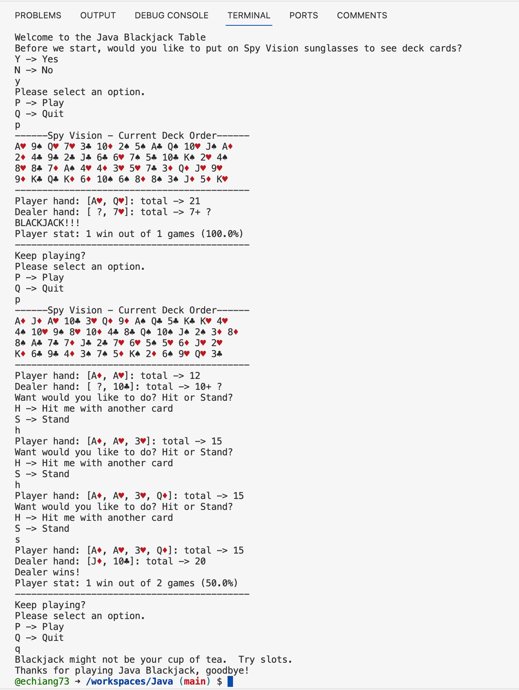

# Java BlackJack Game

## Technical overview
This is a repository of Java files. To run the Java program as a webapp on a browser, the files need to be compiled and then the Java application to be run on a cloud server with a Java Virtual Machine (JVM).  You can download the files and run them on your IDE like Visual Studio Code, IntelliJ, or Eclipse. 
 Alternatively, GitHub Codespaces allows for a "local" repository with a JVM to be created in the cloud server with a UI that represents a Microsoft Visual Studio Code IDE.  The Java code can be edited and run from the codespace. To create and opens a codespace, in this Java Repository, click on the green button labeled "<> Code" and select the "Codespaces" tab.  If no codespace has been created, click on the green "Create codespace on master" button. A browser tab will open with the GitHub Cloudspace and the cloud server will take some time to spin up. Note, before running any Java program in the GitHub codespace, make sure to install the recommended 'Extension Pack for Java' extension from Microssoft for the Java language. To run the Java application, navigate to the Main.java file with the entry point.  The code for the Main.java file will open on the right panel. Press the "Run" button which is a right-pointing triangle that's on the right of the tab.

## Built with or topics covered
* Core Technology (Java)
* Git version control
* GitHub repository
* GitHub Cloudspace JVM and deployment

## Here is the preview of the application using terminal:

